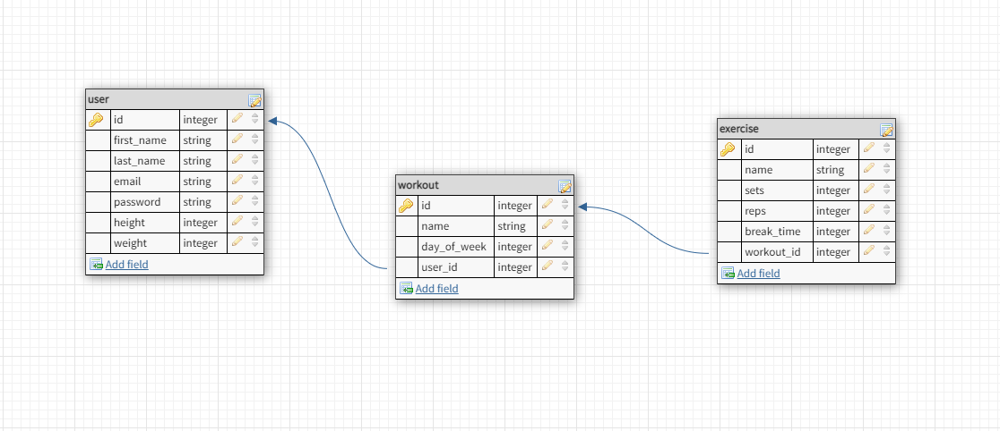

# workout-tracker-api

## App Description

Workout Tracker API is an RESTful API server. Our app is created from nodejs express with knex for database query. Visit this [github repository](https://github.com/faceless5879/workout-tracker) for the frontend.

## Getting Started

### Prerequisites:

Windows and iOS

## Environment

### Installing dependencies

First, install the dependencies for this project:

```shell
  $ npm install || npm i
```

### Running the app

To run the server with nodemon:

```shell
  $ npm run dev
```

This should run nodemon and makes our server up.

You should be in the db directory when you want to run these scripts:

- To run the migration:

```shell
  $ npm run migrate-lastest
```

This migration is for creating the tables.

- To run the seeds:

```shell
  $ npm run seed-data
```

## Schema Design

- Workout Tracker Schema:



## Resources

- [Node.js](https://nodejs.org/en/)
- [express](https://expressjs.com/)
- [knex](https://knexjs.org/)
- [CORS](https://www.npmjs.com/package/cors)
- [jsonwebtoken](https://jwt.io/)
- [connect-timeout](http://expressjs.com/en/resources/middleware/timeout.html)
- [schema](http://dbdesigner.net/)
